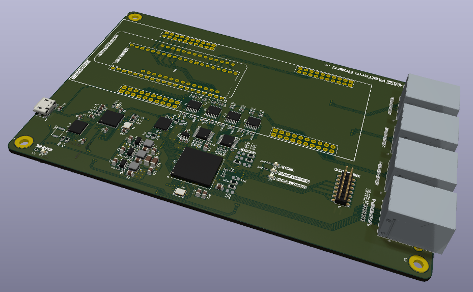
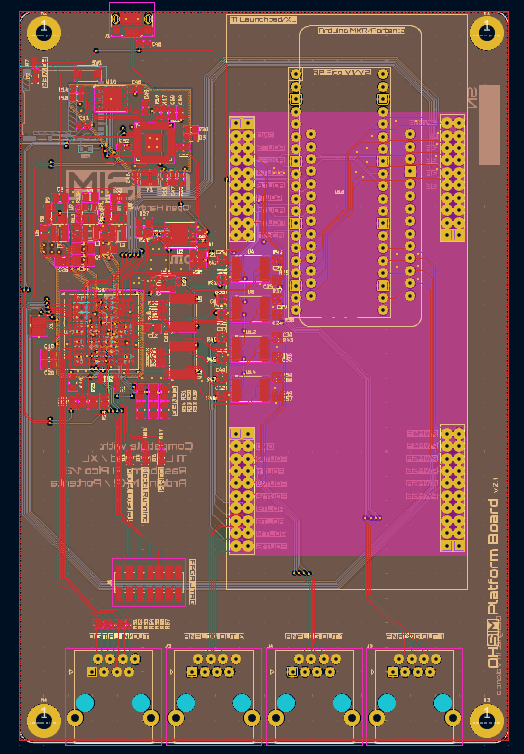
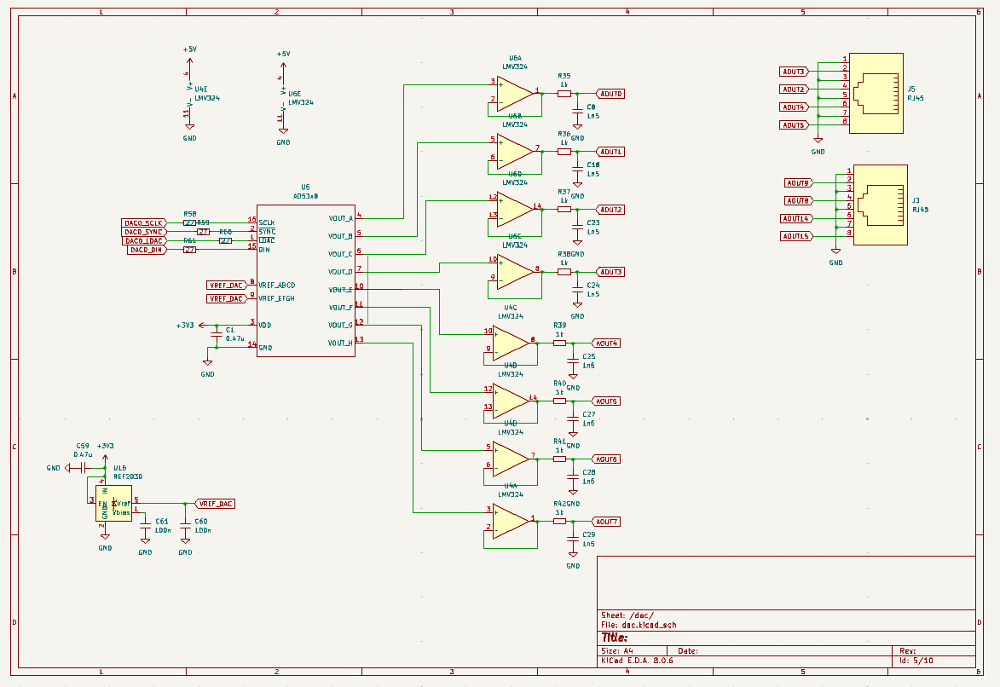
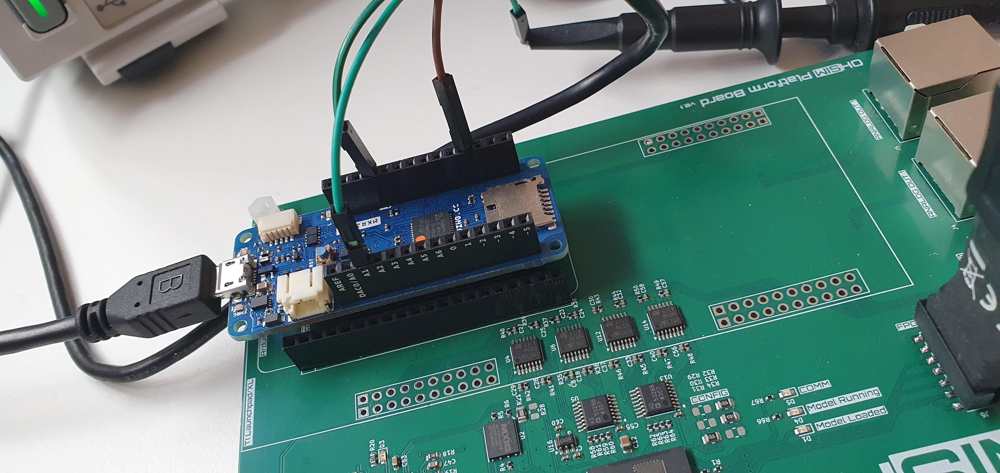
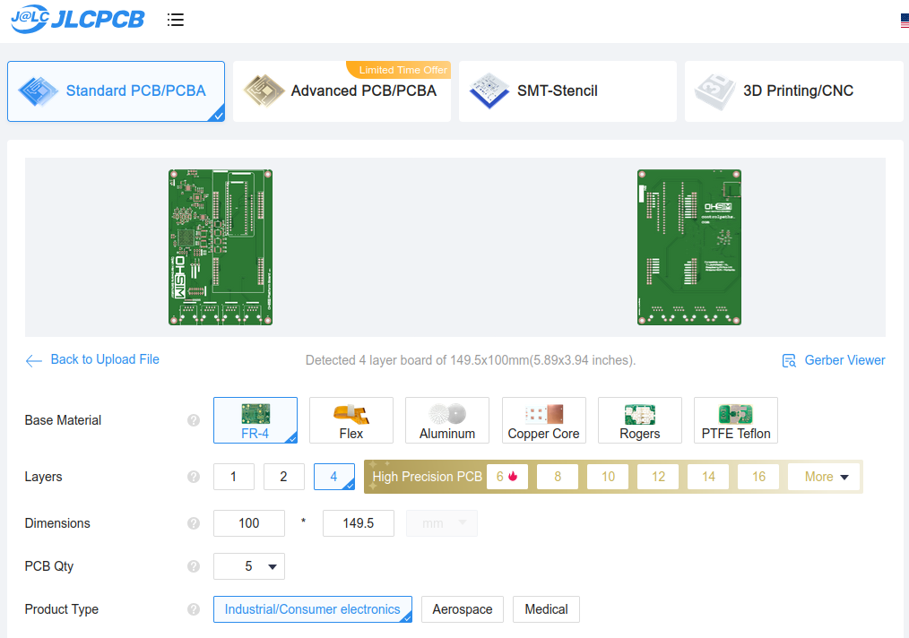

# Platform Board

This board is intended to run real time simulation models and connect them to different commercial platforms like Arduino or TI Launchpad. The core of the board is an FPGA able to run models with time steps up to 100ns.

The board is based on a 4-layer PCB with an RP2040 as a platform manager. 

## FPGA 

The FPGA used is the AMD Spartan 7 s15 with 15K logic cells. The package used is FTGB196, which makes the board compatible with FPGAs up to 50k logic cells.

## DAC outputs

The board features two Digital to Analog converters with 8 channels each. The output range of the DAC is 0 - 3 volts with 12 bit resolutions, and an update rate up to 100 ksps.

## Control boards

The platform board is compatible with:

- Arduino MKR
- Arduino Portenta
- Raspberry PI Pico
- Texas Instruments Launchpad Boards

## Build your own

The Platform Board is open-source, so you can use the output files to manufacture your own in [JLCPCB](https://jlcpcb.com/?from=controlpath). You just need to compress the `production_files` directory, and upload it to [JLCPCB](https://jlcpcb.com/?from=controlpath). 

Remember to change the Surface Finish to **LeadFree HASL** to make your board ROHS compliant.

In a few days, you will receive your board at home.